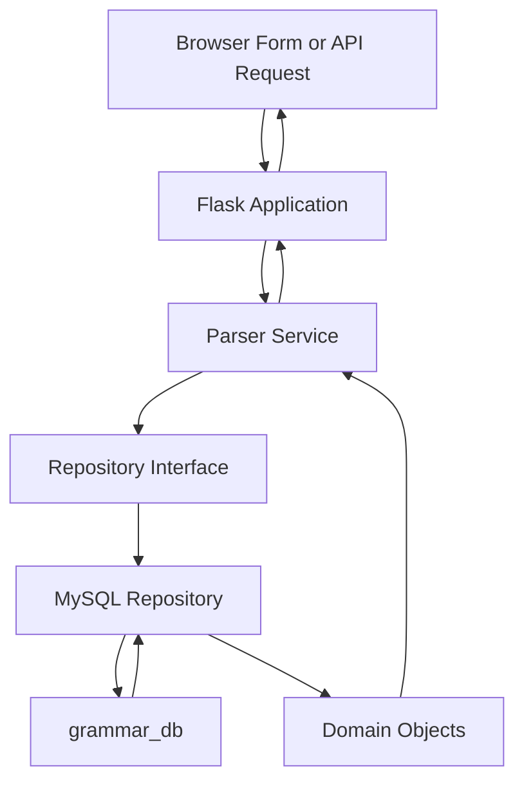

# RossFreeman-LING508S-Project
https://github.com/rossfreeman23/RossFreeman-LING508S-Project
# Irish Noun Morphological Parser

A database-backed Flask application that retrieves the complete stored morphological paradigm of a single Irish noun.

The project was created for LING 508-S as my first complete software application. It demonstrates object-oriented programming, domain modeling, database normalization, the repository pattern, service-layer dependency separation, Flask development, and automated testing.

## Features

* Browser-based Irish noun search form
* JSON API compatible with Postman and `curl`
* MySQL lexical database
* Complete stored noun paradigms
* Nominative, genitive, dative, and vocative cases
* Singular and plural forms
* Gender and declension information
* Mutation information, including lenition and eclipsis
* Input validation and helpful error responses
* Repository interface separating SQL from business logic
* Unit, integration, Flask, and end-to-end tests

## Application Architecture



Each layer has a separate responsibility:

* **Flask layer:** Receives HTML and JSON requests and returns responses.
* **Service layer:** Validates noun input and prepares the use-case output.
* **Repository layer:** Isolates MySQL queries and converts database rows into domain objects.
* **Domain layer:** Represents lexical entries, nouns, noun forms, and grammatical enumerations.
* **Database layer:** Stores lexical entries and complete noun paradigms.

## Project Structure

```text
RossFreeman-LING508S-Project/
├── app.py
├── config.py
├── requirements.txt
├── README.md
├── .gitignore
│
├── db/
│   ├── __init__.py
│   ├── db_interface.py
│   └── mysql_db.py
│
├── models/
│   ├── __init__.py
│   └── models.py
│
├── parser_service/
│   ├── __init__.py
│   └── parser_service.py
│
├── sql/
│   └── init.sql
│
├── templates/
│   └── index.html
│
└── tests/
    ├── __init__.py
    ├── test_app.py
    ├── test_db.py
    ├── test_end_to_end.py
    ├── test_models.py
    └── test_service.py
```

## Domain Model

The application uses four domain classes:

* `Word`: Represents a surface form entered by a user and its possible lexical entries.
* `LexicalEntry`: Stores a lemma, definition, part of speech, and optional noun data.
* `Noun`: Stores gender, declension, and a list of noun forms.
* `NounForm`: Stores one surface form and its case, number, and mutation.

Grammatical categories are represented with integer-valued Python enumerations:

* `PartOfSpeech`
* `Gender`
* `Declension`
* `Case`
* `Number`
* `Mutation`

## Database

The MySQL database is named `grammar_db` and contains three normalized tables:

### `lexical_entries`

Stores dictionary-level information:

* Lemma
* Part of speech
* English definition

### `nouns`

Stores noun-specific information:

* Associated lexical entry
* Gender
* Declension

### `noun_forms`

Stores individual inflected forms:

* Associated noun
* Surface form
* Grammatical case
* Grammatical number
* Mutation

Foreign-key cascade rules preserve the relationships between these tables.

Enum-like grammatical values are stored as small integers in MySQL and converted back into Python enum objects by `MysqlRepository`.

## Representative Data

The database currently contains manually entered complete paradigms for:

| Lemma   | Definition | Gender    | Declension |
| ------- | ---------- | --------- | ---------- |
| `teach` | house      | masculine | second     |
| `madra` | dog        | masculine | fourth     |

Each noun has eight stored forms: four grammatical cases in singular and plural.

The application performs local database lookups. It does not scrape external websites or make external network requests while running.

## Requirements

* Python 3.9 or later
* MySQL Server 8.4 or a compatible version
* `pip`

Python dependencies:

```text
Flask
mysql-connector-python
pytest
```

The completed application was tested with:

* Python 3.9.6
* Flask 3.1.3
* MySQL Server 8.4.11
* mysql-connector-python 9.4.0
* pytest 8.4.2

## Installation

### 1. Clone the repository

```bash
git clone https://github.com/rossfreeman23/RossFreeman-LING508S-Project.git
cd RossFreeman-LING508S-Project
```

### 2. Create a Python virtual environment

On macOS or Linux:

```bash
python3 -m venv .venv
source .venv/bin/activate
```

On Windows PowerShell:

```powershell
python -m venv .venv
.venv\Scripts\Activate.ps1
```

### 3. Install Python dependencies

```bash
python3 -m pip install --upgrade pip
python3 -m pip install -r requirements.txt
```

On Windows, use `python` instead of `python3` if necessary.

## MySQL Setup

Install and start MySQL Server before running the database-backed tests or application.

For macOS users with Homebrew:

```bash
brew install mysql@8.4
brew services start mysql@8.4
```

If the `mysql` command is not available after installation, add MySQL 8.4 to the shell path:

```bash
echo 'export PATH="/opt/homebrew/opt/mysql@8.4/bin:$PATH"' >> ~/.zprofile
export PATH="/opt/homebrew/opt/mysql@8.4/bin:$PATH"
```

Securing a new local MySQL installation is recommended:

```bash
mysql_secure_installation
```

### Initialize the project database

From the project root:

```bash
mysql -u root -p < sql/init.sql
```

The script:

1. Drops an existing database named `grammar_db`
2. Creates a new `grammar_db`
3. Creates the normalized tables and constraints
4. Inserts the representative noun paradigms

**Warning:** Running `sql/init.sql` replaces any existing MySQL database named `grammar_db`.

## Database Configuration

`config.py` reads MySQL settings from environment variables. It does not contain a database password.

On macOS or Linux:

```bash
export MYSQL_HOST="localhost"
export MYSQL_USER="root"
export MYSQL_PASSWORD="YOUR_MYSQL_PASSWORD"
export MYSQL_DATABASE="grammar_db"
```

On Windows PowerShell:

```powershell
$env:MYSQL_HOST = "localhost"
$env:MYSQL_USER = "root"
$env:MYSQL_PASSWORD = "YOUR_MYSQL_PASSWORD"
$env:MYSQL_DATABASE = "grammar_db"
```

Each user must supply credentials for their own local MySQL installation. Do not commit passwords or `.env` files to the repository.

## Running the Tests

### Tests that do not require MySQL

The model, service, and isolated Flask tests use fake dependencies and can run without a database:

```bash
python3 -m pytest \
    tests/test_models.py \
    tests/test_service.py \
    tests/test_app.py \
    -v
```

### Database tests

After starting MySQL, initializing `grammar_db`, and setting the environment variables:

```bash
python3 -m pytest tests/test_db.py -v
```

### End-to-end tests

```bash
python3 -m pytest tests/test_end_to_end.py -v
```

These tests exercise the complete application path:

```text
Flask → service → repository → MySQL → response
```

### Complete test suite

```bash
python3 -m pytest -v
```

The final verified result is:

```text
62 passed
```

Test organization:

| Test file            | Responsibility                            | Uses MySQL |
| -------------------- | ----------------------------------------- | ---------- |
| `test_models.py`     | Models, enums, attributes, and validation | No         |
| `test_service.py`    | Service behavior with a fake repository   | No         |
| `test_app.py`        | HTML and JSON routes with a fake parser   | No         |
| `test_db.py`         | Real MySQL repository behavior            | Yes        |
| `test_end_to_end.py` | Complete Flask-to-MySQL behavior          | Yes        |

## Running the Application

Ensure MySQL is running and the connection environment variables are set.

From the project root:

```bash
python3 app.py
```

Open the HTML interface:

```text
http://127.0.0.1:5000
```

Enter an Irish noun such as:

```text
teach
```

or:

```text
madra
```

The Flask development server is intended for local development and demonstration, not production deployment.

## API Documentation

### Retrieve a noun paradigm

```http
POST /parse
Content-Type: application/json
```

Request body:

```json
{
  "word": "teach"
}
```

Example `curl` request:

```bash
curl -i \
  -X POST \
  http://127.0.0.1:5000/parse \
  -H "Content-Type: application/json" \
  -d '{"word": "teach"}'
```

Example successful response:

```json
{
  "lemma": "teach",
  "definition": "house",
  "part_of_speech": "noun",
  "gender": "masculine",
  "declension": "second",
  "forms": [
    {
      "surface_form": "teach",
      "case": "nominative",
      "number": "singular",
      "mutation": "none"
    },
    {
      "surface_form": "tí",
      "case": "genitive",
      "number": "singular",
      "mutation": "none"
    },
    {
      "surface_form": "a theach",
      "case": "vocative",
      "number": "singular",
      "mutation": "lenition"
    }
  ]
}
```

The actual successful response includes all eight stored forms.

### Successful response

```text
200 OK
```

### Invalid input

Examples include:

* Missing JSON body
* Missing `word`
* Non-string `word`
* Empty string or whitespace

Response:

```text
400 BAD REQUEST
```

Example:

```json
{
  "error": "word cannot be empty."
}
```

### Noun not found

Response:

```text
404 NOT FOUND
```

Example:

```json
{
  "error": "Noun 'xyz' not found in database."
}
```

## HTML Endpoints

| Method | Endpoint  | Purpose                                          |
| ------ | --------- | ------------------------------------------------ |
| `GET`  | `/`       | Display the Irish noun search form               |
| `POST` | `/search` | Process a form submission and display the result |
| `POST` | `/parse`  | Return the noun paradigm as JSON                 |

## Current Scope and Limitations

* The application currently supports noun lookups only.
* Input must be a stored Irish noun lemma.
* The application retrieves stored paradigms rather than generating forms from linguistic rules.
* The current database contains two representative noun paradigms.
* Additional entries can be added through `sql/init.sql`.
* Flask’s built-in server is for local development and demonstration.

## Future Improvements

Potential extensions include:

* Additional Irish noun paradigms
* Search by inflected surface form
* Additional parts of speech
* A database administration or import tool
* Automated deployment
* A production WSGI server
* Expanded linguistic coverage

## Course Requirements Demonstrated

This project demonstrates:

* A specific use case with defined input and output
* UML-based domain design
* Python classes and integer-valued enumerations
* Constructor validation
* Pytest-based automated testing
* A normalized MySQL database
* A repository interface isolating SQL dependencies
* A service layer with dependency injection
* A Flask API callable with Postman or `curl`
* A browser-based HTML form
* Passing end-to-end tests
* Complete project and endpoint documentation

## Author

Ross Freeman
LING 508-S
